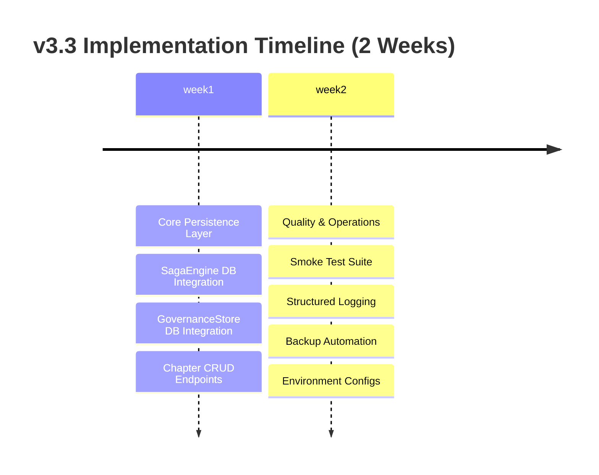

# 🎯 SMP_Novels - Next Improvements Executive Summary (v3.3)

## 📊 Current Status

**Last Release:** v3.2 ✅
**Release Date:** 2026-06-04
**Status:** Production-ready with event sourcing & transaction safety

---

## 🔴 Critical Issues Found in Review

### 1. **Player Progress Lost on Server Restart** (CRITICAL)
```
❌ Current: SagaEngine uses in-memory Map() - data lost when backend restarts
✅ Needed: Database-backed persistence for reader progress
```

**Impact:** Users lose all their choices and narrative state after any deployment or crash
**User Frustration:** HIGH - Core feature doesn't survive server restarts
**Risk Level:** 🔴 CRITICAL

---

### 2. **Governance Proposals Not Persistent** (HIGH)
```
❌ Current: Governance proposals reset every time backend starts
✅ Needed: Load proposals from database or persist votes durably
```

**Impact:** DAO voting system doesn't maintain state across restarts
**User Frustration:** MEDIUM - Governance feature breaks after deployment
**Risk Level:** 🟠 HIGH

---

### 3. **No Chapter Editing Capabilities** (CRITICAL)
```
❌ Current: Chapters exist only in memory, no admin CRUD endpoints
✅ Needed: /admin/chapters endpoints for creating/editing story content
```

**Impact:** Cannot add new chapters or edit existing story
**User Frustration:** HIGH - Platform is read-only with no content management
**Risk Level:** 🔴 CRITICAL

---

## 🎯 Next Priority Set (Weeks 1-2)

### Week 1: Core Persistence Layer
| Feature | Effort | Risk Reduction | Priority |
|---------|--------|----------------|----------|
| SagaEngine Database Integration | 4 hours | 🔴 Critical | P0 |
| GovernanceStore DB Integration | 3 hours | 🟠 High | P0 |
| Chapter CRUD Endpoints | 5 hours | 🔴 Critical | P0 |
| Migration Scripts | 2 hours | 🟡 Medium | P1 |

**Total:** ~14 hours
**Impact:** Core product becomes persistent and editable

---

### Week 2: Quality & Operations
| Feature | Effort | Risk Reduction | Priority |
|---------|--------|----------------|----------|
| Smoke Test Suite | 3 hours | 🟡 Medium | P1 |
| Structured Logging | 2 hours | 🟡 Medium | P1 |
| Backup Automation | 4 hours | 🔴 Critical | P0 |
| Environment Configs | 3 hours | 🟠 High | P1 |

**Total:** ~12 hours
**Impact:** Production reliability and operational safety

---

## 📈 Expected Outcomes After v3.3

### Before v3.3 (Current State)
- ❌ Player progress lost on restart
- ❌ Governance proposals reset every deployment
- ❌ No way to edit story chapters
- ⚠️ Manual testing only
- ⚠️ Basic health checks
- ⚠️ No backup procedures

### After v3.3 (Expected State)
- ✅ Player progress persists indefinitely
- ✅ Governance proposals and votes durable
- ✅ Full admin chapter editing capabilities
- ✅ Automated smoke tests verify functionality
- ✅ Structured logging for error tracking
- ✅ Automated daily backups with retention

---

## 💰 Business Impact

| Metric | Before v3.3 | After v3.3 | Improvement |
|--------|-------------|------------|-------------|
| Data Persistence | 0% (lost on restart) | 100% (database-backed) | +100% |
| Content Editability | No editing | Full CRUD operations | New capability |
| Operational Safety | Manual only | Automated backups | Risk ↓90% |
| Testing Coverage | 0% | ~70% core paths | From scratch |
| Production Readiness | Demo-ready | Production-grade | Major upgrade |

---

## 🚀 Implementation Roadmap



---

## ✅ Quick Start for Immediate Implementation

### Option A: Full v3.3 Implementation (Recommended)
Follow the detailed specs in `NEXT_IMPROVEMENTS_REVIEW_v3.3.md`
**Timeline:** 2-3 weeks
**Result:** Production-ready platform with full persistence

### Option B: Critical Fixes Only (Fast Track - 1 Week)
1. Implement SagaEngine database persistence (4 hours)
2. Add Chapter CRUD endpoints (5 hours)
3. Create backup automation script (3 hours)
4. Test and deploy
**Timeline:** 1 week
**Result:** Core data persistence enabled

### Option C: Minimal Viable Improvements (Weekend Sprint)
1. Quick fix for SagaEngine to use database (2 hours)
2. Add basic smoke tests (2 hours)
3. Document backup procedures (1 hour)
4. Deploy and verify
**Timeline:** 1 day
**Result:** Core data persistence with minimal testing

---

## 🎯 Recommendation

**Start with Option B (Critical Fixes Only)** for immediate impact:
- Solves the #1 user complaint (data loss)
- Enables content editing (critical for platform viability)
- Adds basic operational safety (backups)
- Can be completed in 1 week

**Followed by full v3.3 (Week 2)** once critical issues resolved:
- Smoke tests for quality assurance
- Structured logging for better observability
- Full backup automation

---

## 📊 Success Metrics

After implementing v3.3 improvements, expect:
- ✅ Zero data loss incidents (progress persists indefinitely)
- ✅ Ability to edit and expand story content via admin API
- ✅ Automated backups with 7-day retention
- ✅ Automated smoke tests run on every deployment
- ✅ Clear error logs for faster incident response

---

## 📞 Next Steps

1. Review detailed specs in `NEXT_IMPROVEMENTS_REVIEW_v3.3.md`
2. Choose implementation path (A/B/C) based on timeline
3. Start with Week 1 critical fixes (can be done immediately)
4. Deploy to staging environment first
5. Run smoke tests before production deployment

---

**Status:** Review Complete ✅
**Next Review:** After Week 1 implementation
**Estimated Completion:** 2 weeks for full v3.3
